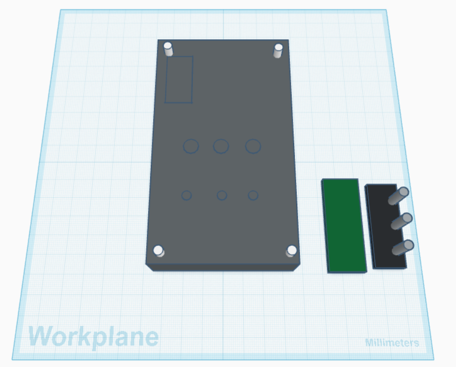
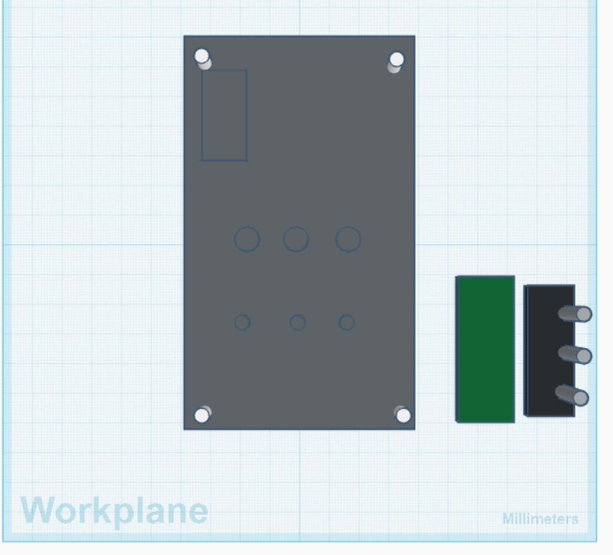
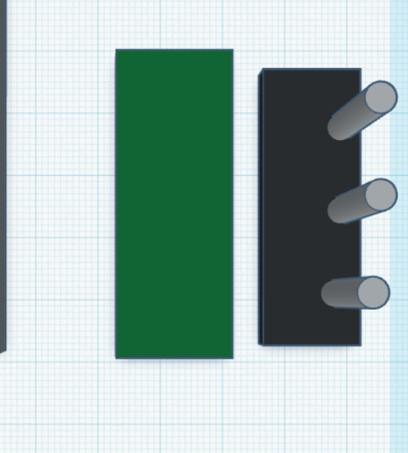
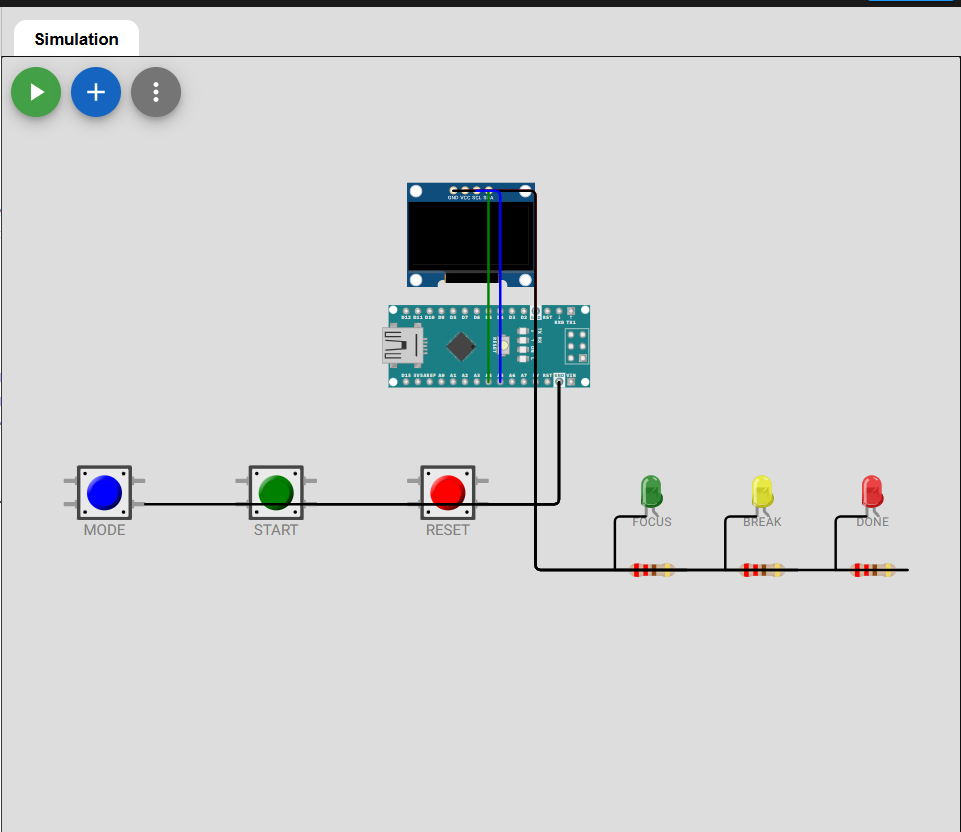

# CodeDeck

CodeDeck is a small desk gadget for programmers. It runs on a microcontroller with C++ firmware and uses physical buttons, LEDs, and a small display to help manage coding sessions.

The idea is simple: instead of opening another timer app or getting distracted by my browser, I want a small device on my desk that can handle focus sessions, break timers, and quick status feedback while I work.

## What It Does

CodeDeck has a few basic modes:

- Focus mode for coding sessions
- Break mode for short rests
- Status display for showing what mode is active
- LED feedback so I can understand the state quickly without reading the screen

The device is controlled with buttons. One button changes the mode, one starts or pauses the timer, and one resets the current timer. The display shows the current mode and remaining time, while the LEDs give fast visual feedback.

## Why I Made It

I spend a lot of time coding, especially in C++, and I wanted to make a project that connects to something I actually do every day. A lot of beginner hardware projects feel like demos that get taken apart right after they work once. I wanted CodeDeck to feel closer to a real little product: a case, buttons, LEDs, a display, and firmware that all work together.

This project also gives me a reason to practice embedded C++ in a practical way. I am not just blinking an LED; I am building a small tool that could live on my desk and become part of how I study, code, and focus.

## How You Use It

1. Power on CodeDeck using USB.
2. The screen shows the current mode.
3. Press the Mode button to switch between Focus and Break.
4. Press Start/Pause to begin or pause the timer.
5. Press Reset to restart the current mode.
6. Watch the LEDs for quick status:
   - Focus LED means a coding session is active.
   - Break LED means break mode is active.
   - Done LED turns on when the timer finishes.

## Planned Hardware

CodeDeck is designed around a simple microcontroller setup. The first version uses a microcontroller, three buttons, three LEDs, resistors, and a small OLED display. The parts are mounted inside a compact desk case so the project feels solid instead of like loose wires on a breadboard.

The case will have cutouts for:

- OLED display
- Mode button
- Start/Pause button
- Reset button
- Status LEDs
- USB cable

## Images

Current design images:






Still needed before submitting:

- Screenshot of the zine page

## Bill of Materials

The full BOM is in [bom/bom.csv](bom/bom.csv).

Main parts:

- Arduino Nano or compatible microcontroller
- 0.96 inch I2C OLED display
- 3 push buttons
- 3 LEDs
- Resistors
- Jumper wires
- Breadboard or custom PCB
- 3D printed or CAD-designed case

## Repository Structure

```text
CodeDeck/
  README.md
  bom/
    bom.csv
  cad/
    README.md
  firmware/
    CodeDeck.ino
  images/
    README.md
  wiring/
    README.md
  zine/
    zine-text.md
  SUBMISSION_CHECKLIST.md
```

## Firmware

The firmware is written in C++ for an Arduino-style microcontroller. It handles button input, mode switching, timer state, LED output, and OLED display updates.

The source code is in [firmware/CodeDeck.ino](firmware/CodeDeck.ino).

## Current Status

- Project idea: complete
- README draft: complete
- Firmware starter: complete
- BOM draft: complete
- CAD model: needs to be made
- Wiring diagram: needs to be made
- Zine page: needs to be designed
- Final IRL build photos/video: needed after building

